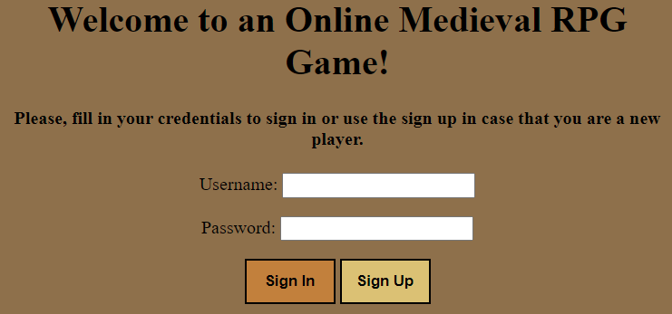
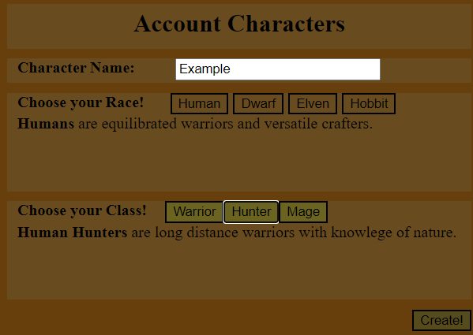
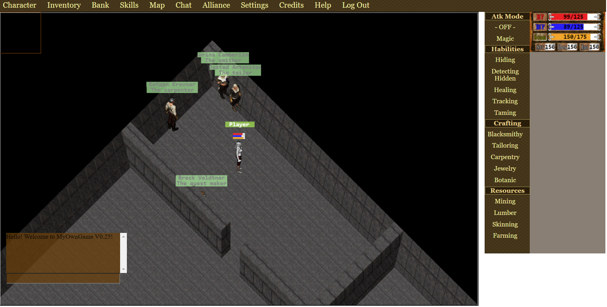
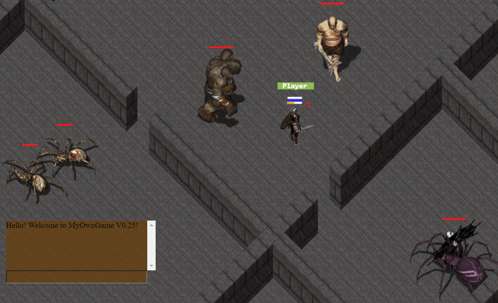

# MyOnlineRPG-IntroPage
This project started in 2017 as a way to learn how socket communications between client and server works, and enjoy the learning process by creating something pleasant. That is why I created an online web-based medieval RPG game. It still has lots of work to be done, but you can already have some fun with friends once you get to know how it works.

1st step: The login page! If you click on the link below you will be redirected to a login page. For updates in the communication between Mongo DB atlas and the server, the DB is switched off temporarily. So you can fill any credentials to get to the second page since the DB is offline.

2nd step: After the login you will be redirected to a place to create your own character. Set its name, race and class and you will be all set to play in the medieval fantasy world.

3rd step: When in the world game, you will be presented with a quick-starting guide. Take a minute just to get used to the movements and how everything works. Don't forget to buy some equipment from the NPC's before entering any portal. Some of the monsters are waiting for you on the other side of the portal of the first map. If you have a friend, call him to play with you, exploring, trading items and fighting together.

Game: https://ancient-tor-88496.herokuapp.com/

You can validade my project by looking at the 'credits' tab, since my repository is private. The full source-code has grown to 65k lines of code but I have plans to release the game in the future, so that is why it is private.

It uses JavaScript in the client and server and the Node.js for socket communication, while the database used was the MongoDB. It is allowed to have 1 character per account in the DB, but I shall add 2 more character per account in the near future. The frontend was developed using a mixture of pure JavaScript and jQuerry and jQuerryUI, using static HTML and CSS only for the basic web configuration.

Any suggestions or feedback? Please let me know!
